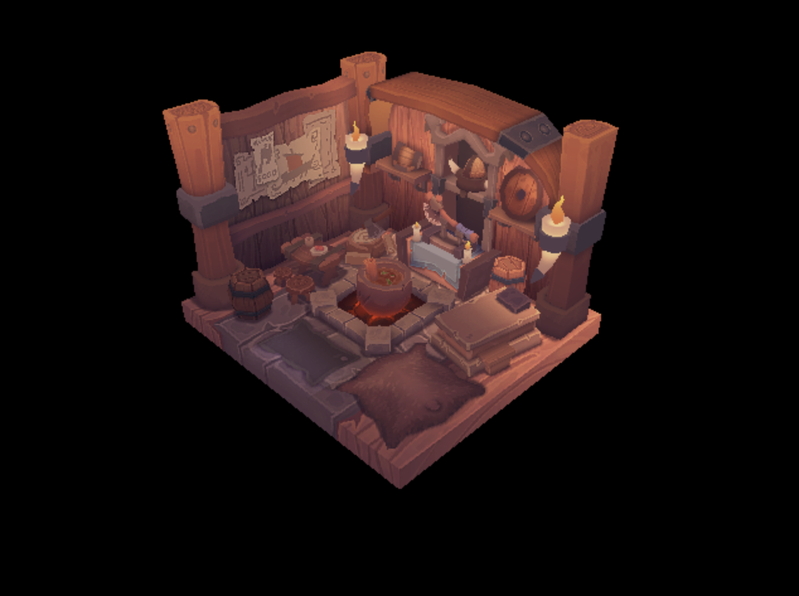

# Rasterizer-C

A very simple software rasterizer implementation for educational purposes.

It uses the point-in-triangle method using barycentric coordinates to rasterize triangles. It supports perspective-correct texture mapping and currently runs on a fixed resolution of 640 x 480 pixels.

## TODO

* Near and far plane clipping
* Parallelize the triangle rasterization loop
